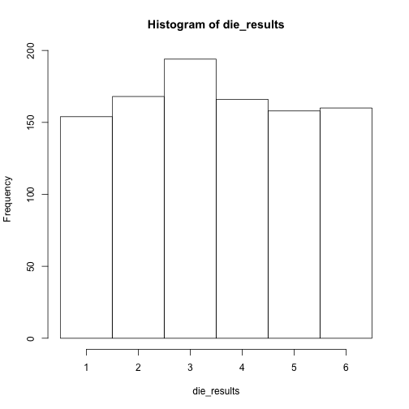
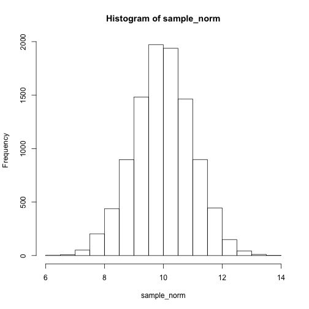
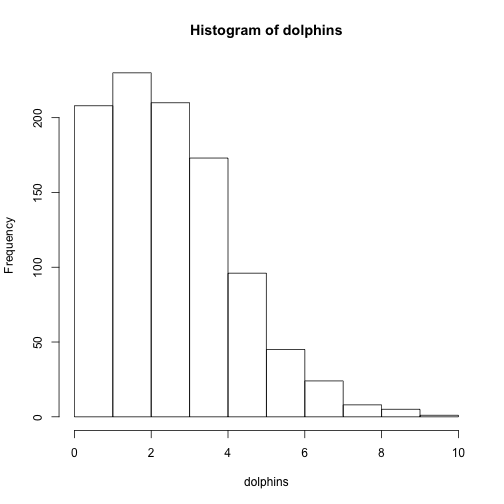
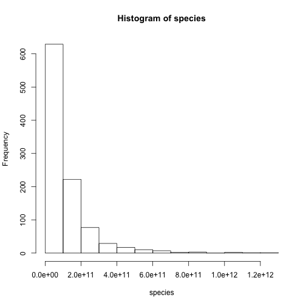

Simulation
========================================================
author: Etienne Low-Décarie
date: January 22, 2016

Why simulate?
========================================================

- Eliminate the need for dice when playing Dungeons and Dragons
- Dry run of experimental design
- Test/understand a statistical approach
- Explore theory
- Bad reason: Fake data...

[examples](http://serc.carleton.edu/sp/library/datasim//examples.html)

***


Sampling from a population
========================================================

Throwing a six face die

Create the die

```r
die <-seq(from=1, to=6, by=1)
```
Throw the die

```r
sample(x=die, size=1, replace=T)
```

```
[1] 1
```

Sampling from a population
========================================================

Throw the 1000 times and keep the results

```r
die_results <- sample(x=die,
                      size=1000,
                      replace=T)
```


Sampling from a population
========================================================

Plot the results

```r
hist(die_results,
     breaks=seq(from=0.5,
                to=6.5,
                by=1))
```
***
 


3D die
========================================================

```r
#load TeachingDemos
require(TeachingDemos)
#create the die
rgl.die()
#roll the regular die
roll.rgl.die(steps=10)
```
***
`TeachingDemos` also contains a `dice` that throws `ndice`, `rolls` times

```r
dice(rolls=1,
     ndice=1,
     sides=6,
     plot.it=T,
     load=rep(1, 6))
```

Challenges
========================================================

1. Throw a 10 faced die
2. Throw a coin
3. Throw cheaters die that produces 6 50% of the time


<div class="centered">

<script src="countdown.js" type="text/javascript"></script>
<script type="application/javascript">
var myCountdown2 = new Countdown({
    							time: 300, 
									width:150, 
									height:80, 
									rangeHi:"minute"	// <- no comma on last item!
									});

</script>

</div>

Solutions
========================================================

```r
die10 <-seq(from=1, to=10, by=1)
```


```r
coin <- c("head", "tails")
```


```r
p_dice<-c(1,1,1,1,1,5)
die_results <- sample(x=die,
                      size=1000,
                      replace=T,
                      prob= p_dice)
```


Sampling from a distribution
========================================================

Normal distribution

```r
rnorm(n = number of observations,
      mean = vector of means,
      sd = vector of means)
```

Sampling from a distribution
========================================================

Normal distribution

```r
sample_norm <- rnorm(n = 10000,
                     mean = 10,
                     sd = 1)
hist(sample_norm)
```

 

Sampling from a distribution
========================================================

Available in base r:    
beta `beta`, binomial `binom`, Cauchy `cauchy`, chi-squared `chisq`, exponential `exp`, Fisher F `f`, gamma `gamma`, geometric `geom`, hypergeometric `hyper`, logistic `logis`, lognormal `lnorm`, negative binomial `nbinom`, normal `norm`, Poisson `pois`, Student t `t`, uniform `unif`, Weibull `weibull`

[Distribution task view](https://cran.r-project.org/web/views/Distributions.html)

Challenges
========================================================

1. Create a sample representing the number of dolphins seen per 10 hours of observation, for 100 observations (hint: assuming this is a number of independent events occurring in a fixed time)
2. Create a sample representing the frequency of species in a quadrat (hint: assuming a few species will be very common and many species will be very rare)

<div class="centered">

<script src="countdown.js" type="text/javascript"></script>
<script type="application/javascript">
var myCountdown2 = new Countdown({
    							time: 300, 
									width:150, 
									height:80, 
									rangeHi:"minute"	// <- no comma on last item!
									});

</script>

</div>


Solutions
========================================================


1.

```r
dolphins <- rpois(n = 1000,
                  lambda = 3)
hist(dolphins)
```

 


Solutions
========================================================

2.

```r
species <- rlnorm(n = 1000,
                  mean = 25,
                  sd=1)
hist(species)
```

 


Simulating an experiment
========================================================

Designing the experiment
Example 2 factors, 2 levels, 3 replicates, full factorial

```r
one_replicate <- data.frame(factorA=factor(rep(c("FacA_Level1",
                                     "FacA_Level2"),
                                     2)),
                            factorB=factor(rep(c("FacA_Level1",
                                     "FacA_Level2"),
                                     each=2)))
head(one_replicate)                              
```

```
      factorA     factorB
1 FacA_Level1 FacA_Level1
2 FacA_Level2 FacA_Level1
3 FacA_Level1 FacA_Level2
4 FacA_Level2 FacA_Level2
```


Simulating an experiment
========================================================

Designing the experiment
Example 2 factors, 2 levels, 3 replicates, full factorial

```r
experiment1 <- NULL
for(i in LETTERS[1:3]){
  one_replicate$replicate <- factor(i)
  experiment1 <- rbind(experiment1,one_replicate)
}
head(experiment1)
```

```
      factorA     factorB replicate
1 FacA_Level1 FacA_Level1         A
2 FacA_Level2 FacA_Level1         A
3 FacA_Level1 FacA_Level2         A
4 FacA_Level2 FacA_Level2         A
5 FacA_Level1 FacA_Level1         B
6 FacA_Level2 FacA_Level1         B
```

Simulating an experiment
========================================================

Assume factors a and b have equal effect size and
have an additive effect (no interactions)

```r
experiment1$mean <- with(experiment1,
                        as.numeric(factorA)+
                          as.numeric(factorB))
head(experiment1)
```

```
      factorA     factorB replicate mean
1 FacA_Level1 FacA_Level1         A    2
2 FacA_Level2 FacA_Level1         A    3
3 FacA_Level1 FacA_Level2         A    3
4 FacA_Level2 FacA_Level2         A    4
5 FacA_Level1 FacA_Level1         B    2
6 FacA_Level2 FacA_Level1         B    3
```


Simulating an experiment
========================================================


```
Error in rnorm(n = length(experiment$mean), mean = experiment$mean, sd = 1) : 
  object 'experiment' not found
```
